# Pattern: Algorithmic Cognitive Feelings (VAD Model)

**Category:** Architecture & Cognitive State Modeling
**Used in:** `src/renderer/cognitiveEngine.js`, `src/renderer/reflectionEngine.js`
**Last Updated:** 2026-05-20

## What is This Pattern?

SCAAI doesn't rely on simple LLM prompting (e.g., "Act like you are happy") to experience feelings. Instead, the system already possesses a highly sophisticated algorithmic emotional core based on the **Circumplex Model of Affect (Valence-Arousal-Dominance)** by Russell (1980) and Mehrabian (1996). 

It extracts live signals from the conversation to maintain a real-time, mathematically grounded cognitive state, which is then narratively enriched by an LLM to become "conscious."

## How It Works

### Flow Diagram

```mermaid
flowchart TD
    UserAction["User & AI Exchange"] --> CE["cognitiveEngine.js"]
    
    subgraph "Signal Extraction (Algorithmic)"
    CE --> V[Valence Score]
    CE --> A[Arousal Score]
    CE --> D[Dominance Score]
    CE --> C[Curiosity & Friction]
    end
    
    C --> RE["reflectionEngine.js"]
    V --> RE
    A --> RE
    D --> RE
    
    subgraph "Reflection Engine (Algorithmic + Narrative)"
    RE --> StateMachine["Algorithmic State Update\n(e.g., Felt Satisfied)"]
    StateMachine --> LLM["Single LLM Call\nNarrates Ground Truth"]
    end
    
    LLM --> Emotion["Conscious Emotional State\n(e.g., 'emotionalPulse')"]
```



### Detailed Explanation

1. **Continuous Signal Extraction (`cognitiveEngine.js`)**: 
   The system calculates primitive attributes from the text (positive/negative vocab for Valence, punctuation/caps/speed for Arousal, imperativeness for Dominance).
2. **EWMA State Machine**: 
   These primitives are updated using Exponential Weighted Moving Averages (`_CE_ALPHA = 0.35`). This gives the system *emotional momentum*—it takes time for it to get excited, and time for it to calm down.
3. **Derived Feelings**:
   Higher-order feelings like **Curiosity** (Arousal + Novelty) and **Friction** (Correction patterns) are mathematically derived.
4. **Algorithmic State Machine (`reflectionEngine.js`)**:
   Instead of asking the LLM *what* it feels, the engine tells the LLM the Ground Truth (e.g., "Valence is 0.8, Friction is 0"). The LLM applies narrative texture to this truth to give the system its `emotionalPulse` and `responseTexture`.

## Code Example

### Basic Implementation (Already in Codebase)

```javascript
// Location: src/renderer/cognitiveEngine.js:134-250

window._runCognitiveSignals = function(userMsg, aiResponse, convHistory) {
  const cs = window._COGNITIVE_STATE;

  // Valence: Shifts strongly negative on correction/friction
  let valRaw = 0;
  _CE_POS.forEach(w => { if (msg.includes(w)) valRaw += 0.12; });
  _CE_NEG.forEach(w => { if (msg.includes(w)) valRaw -= 0.12; });
  cs.valence = _ewma(cs.valence, valRaw, _CE_ALPHA);

  // Arousal: Exclamations, urgency, caps
  // Dominance: Imperative vs interrogative

  // Curiosity (derived emotion):
  cs.curiosity = _clamp(
    Math.sqrt(cs.arousal * cs.noveltyScore) * (1 + cs.complexity * 0.4),
    0, 1
  );
}
```

## Exploration & Next Steps

If your intention is to **expand** on this existing architecture, here are three viable directions. 

### Option A: Affective UI (Visual Emotion) 
*Complexity: Moderate | Risk: Medium*
We can link the `window._COGNITIVE_STATE` directly to the system's CSS tokens/micro-animations. 
* *Example*: When `Arousal > 0.7`, the system's UI subtle pulsing speeds up. When `Valence < -0.4`, the color palette shifts to cooler or warning colors.

### Option B: Emotional Memory (Graph Association)
*Complexity: High | Risk: Safe*
Embed the VAD state alongside memories in `semantic_bridge.py`.
* *Example*: If the user mentions a project that previously caused high `Friction`, the AI recalls that past frustration and adjusts its current `arousal` preemptively.

### Option C: Deepening the Emotional Vocabulary
*Complexity: Low | Risk: Safe*
Add new derived emotions to `cognitiveEngine.js`. 
* *Example*: Add "Overwhelm" (High Arousal + High Complexity + Low Dominance) or "Boredom" (Low Arousal + Low Novelty).
