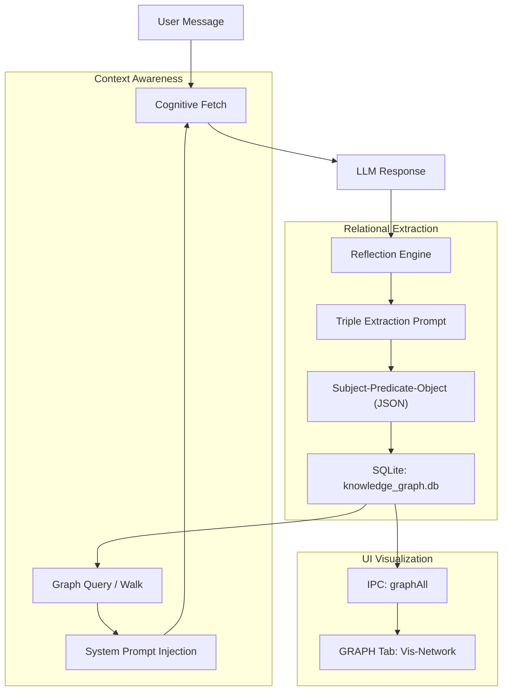

# System: GraphRAG & Relational Memory Engine

**Status**: Production
**Owner**: Cognitive Architecture Team
**Last Updated**: 2026-04-20

## Overview
The GraphRAG engine extends SCAAI's cognitive capabilities by introducing a structured, relational memory layer. While standard RAG uses vector similarity to find related text, GraphRAG maps explicit connections between entities (people, projects, concepts), allowing for multi-hop reasoning and high-integrity architectural awareness.

## Architecture

### GraphRAG Pipeline
The system extracts knowledge from conversations in real-time and injects it back into the context based on relational relevance.

### Components

#### 1. Knowledge Graph (SQLite)
- **Technology**: SQLite / `semantic_bridge.py`
- **Purpose**: Persistent storage of entities (Subject/Object) and their relationships (Predicate).
- **Location**: `src/main/semantic_bridge.py` (Backend) | `knowledge_graph.db`
- **Tables**: `nodes` (id, label, type, metadata), `edges` (source, target, label, metadata).

#### 2. Triple Extraction (`reflectionEngine.js`)
- **Phase**: Occurs during the "Post-Exchange Reflection" (silent monologue).
- **Logic**: The LLM analyzes the recent exchange specifically to identify new facts (e.g., "The user is working on a React project", "index.css depends on theme.ts").
- **Schema**: Validates extraction into a standard `(s, p, o)` format before commit.

#### 3. Memory Awareness Telemetry
- **Purpose**: Grounding the AI in its own state.
- **Logic**: Before generation, the system counts total entries across all memory stores.
- **Example Injection**: 
  > "[MEMORY STATS: 1,420 ChromaDB chunks, 84 Graph nodes, 156 Relational edges]"

#### 4. Graph Visualizer (Frontend)
- **Technology**: `vis-network`
- **Purpose**: Interactive UI for exploring the knowledge graph.
- **Interactions**: Tab switching triggers a `refreshKnowledgeGraph()` call that rebuilds the network from the SQLite database.

## Data Flow

### Fact Extraction & Storage
1. **Trigger**: Response completes.
2. **Analysis**: Reflector analyzes user/ai turn.
3. **Extraction**: `extractGraphTriples(content)` returns an array of edges.
4. **Persistence**: IPC call to `graphStore(subj, pred, obj)`.

### Relational Context Retrieval
1. **Intent Detection**: `cognitiveEngine` detects a query requiring relational facts.
2. **Retrieval**: `graphQuery(entity)` performs a BFS (Breadth-First Search) on the graph.
3. **Augmentation**: Top related facts are added to the "Relational Context" block in the system prompt.

## Implementation Details
- **Main Logic**: `src/renderer/renderer.js`
- **Relational Backend**: `src/main/semantic_bridge.py`
- **UI Container**: `#tgraph` in `index.html`
- **Extraction Hook**: `_runPostExchangeReflection()` inside `reflectionEngine.js`

## Troubleshooting
- **Missing Nodes**: If nodes aren't appearing, verify the `reflectionEngine` is successfully parsing the extraction JSON.
- **Graph Lag**: Large graphs (>5,000 nodes/edges) may cause UI latency in the visualization tab.
- **Stale Data**: Close and reopen the 'GRAPH' tab to force a re-fetch of the SQLite state.
