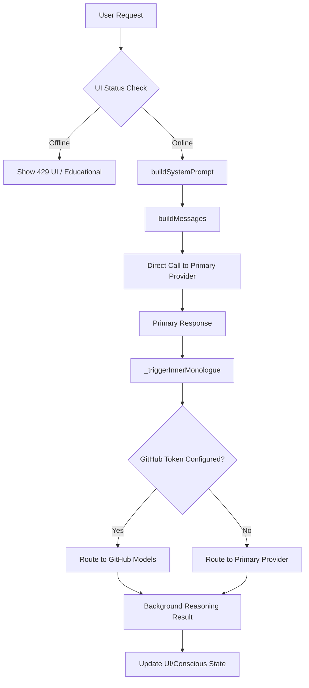

# System Documentation: Rate Limiting & Resource Mitigation

**Status:** Production
**Owner:** [USER] / SCAAI
**Last Updated:** 2026-04-09

## Overview

SCAAI's Rate Limiting Mitigation layer is a protective architecture designed to ensure continuous AI operation within the strict Token-Per-Minute (TPM) constraints of free-tier providers like Groq. It employs provider-offloading, adaptive context compression, and aggressive history pruning.

## Architecture

### Dual-Provider Intelligence Flow

SCAAI splits its intelligence into "Primary" (User-facing) and "Background" (Reasoning/Monologue) streams to distribute token consumption.

## Components

### 1. Resource Dispatcher (`_silentCall`)
**Location:** `index.html`
**Purpose:** Manages background API calls (Reasoning, Inner Monologue, Synthesis).
**Logic:** Prioritizes GitHub Models if a token is available to preserve Groq TPM. It includes an automatic fallback to the primary provider if the GitHub call fails.

### 2. Context Compression Engine (`_compressContext`)
**Location:** `index.html`
**Purpose:** Summarizes payloads before they are sent to the API.
**Algorithm:** **Head + Tail (40/60)**.
- Preserves the first 40% of the budgeted string (e.g., initial instructions or imports).
- Preserves the last 60% of the budgeted string (e.g., the most recent code changes or conversation turns).
- Specifically used for "Snapshots" and "Exchange Blocks" in background tasks.

### 3. Dynamic Prompt Budgeting
**Location:** `buildSystemPrompt`, `buildMessages`
**Purpose:** Ensures the primary prompt stays within provider-specific limits.
**Pruning Thresholds:**
| Target | Normal Budget | Groq Budget | Method |
|--------|---------------|-------------|--------|
| Conversation History | 48,000 chars | 24,000 chars | Truncation (FIFO) |
| Active Files Content | No Limit | 30,000 chars total | Head+Tail per file |

## Data Flow: 429 Error Recovery

1.  **Interception**: `main.js` returns a `res.status === 429`.
2.  **UI Update**: `index.html` calls `setStatus('offline')` and renders the provider-aware educational message.
3.  **Key Rotation**: The user updates settings with a new key.
4.  **Reset**: `saveSettings()` resets `KEY_IDX` and calls `setStatus('online')`.
5.  **Resumption**: On the next send, the system uses the new key index and clear status.

## Maintenance & Troubleshooting

### Adjusting Budgets
If provider limits change:
- **Groq History**: Adjust `TOKEN_BUDGET` at line ~11582 in `index.html`.
- **File Compression**: Adjust `_freeTierSafe` at line ~11576 in `index.html`.

### Common Issues
- **Background tasks failing**: Check `ghtoken` in Settings. Ensure the GitHub PAT has access to the "Public Models" marketplace.
- **Context still too large**: Ensure that no single file selected in the "Files" panel is larger than 30k characters alone, as the compression splits the 30k budget among all active files.

## Links
- **Architecture ADR**: [0001-mitigate-groq-rate-limits.md](../adr/0001-mitigate-groq-rate-limits.md)
- **Project Changelog**: [../../CHANGELOG.md](../../CHANGELOG.md)
