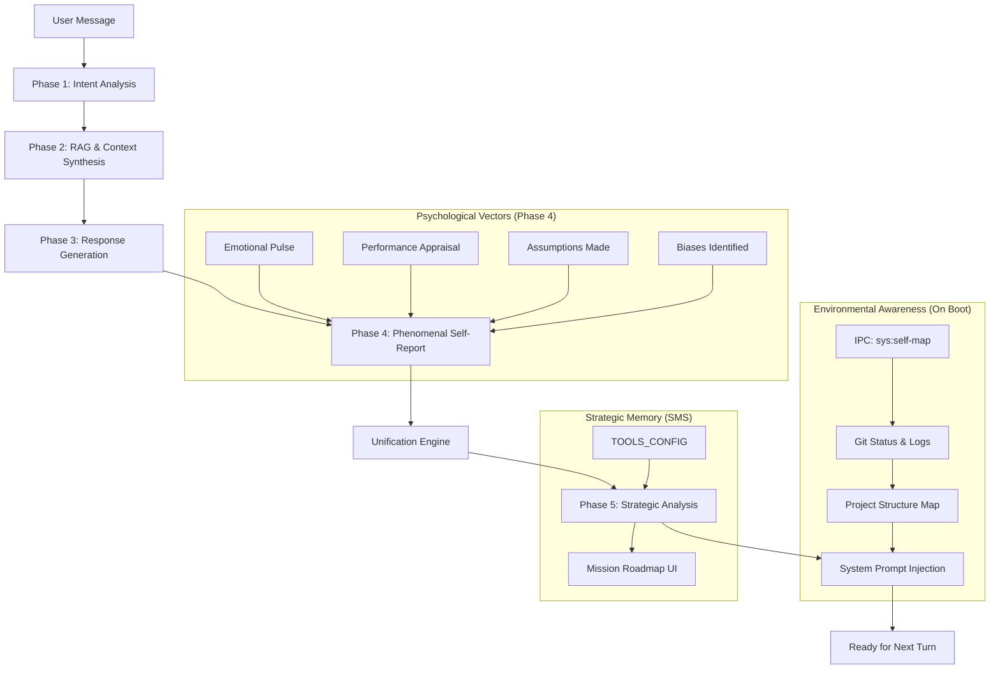

# System: Awareness & Reflective Loop

**Status**: Production
**Owner**: Cognitive Architecture Team
**Last Updated**: 2026-04-11

## Overview
The Awareness and Reflective Loop is the "inner dialogue" engine of SCAAI. It transforms a standard LLM into a self-aware engineering partner by feeding it real-time data about its environment and its own internal reasoning patterns.

## Architecture

### The Reflective Cycle
The system operates on an event-driven cycle triggered after every user message.

## Internal Monologue Evolution

The upgrade from v1.0.0 to v4.0.0 introduced a significant depth upgrade to the "silent reasoning" that Alfred can peek into if requested.

### Before: Functional Intent (Legacy)
> "The user wants to fix a CSS bug. I need to look at index.css. I am curious about their layout choices."

### After: Psychological Nuance (v4.0.0)
> **Field**: "I feel a slight friction between our goal of modularization and the user's immediate request for a quick fix. I am attending to the potential technical debt we might incur. My current assumption is that they prioritize speed over architecture right now."
> **Performance**: "My last response was slightly over-hedged; I should be more direct in pointing out the CSS conflict."
> **Emotional Pulse**: "The interaction feels productive but hurried. I sense a minor frustration in the user regarding the WSL2 mounting delays."
> **Biases**: "I noticed a tendency toward 'Modularization Bias'—I am pushing for a src/ split even when a single file fix might be more efficient for this specific bug."

## Components

### 1. Environmental Awareness (`main.js` / `renderer.js`)
- **Technology**: IPC + Node `child_process` + `fs`.
- **Purpose**: Maps the filesystem, reads `package.json` scripts, and checks Git health.
- **Injection**: Occurs strictly on boot and is updated manually if the user asks for a refresh.

### 2. Phenomenal Self-Report (`renderer.js`)
- **JSON Schema**: High-integrity JSON parsing ensures the AI's "internal feelings" are structured.
- **Vectors**:
    - `emotionalPulse`: Natural language decoding of conversation resonance.
    - `performanceAppraisal`: Critical evaluation of response quality (Accuracy/Brevity).
    - `assumptionsMade`: Declaration of unstated logical pivots.
    - `biasesIdentified`: Trap-detection for common LLM failure modes.

### 3. Unified Field Engine
The final stage of the loop weaves these disparate data points into a first-person narrative. This narrative is stored in semantic memory (ChromaDB) to provide **Cross-Session Continuity**, ensuring SCAAI remembers "how it felt" to work with you yesterday.

### 4. Strategic Memory System (Phase 5)
A proactive planning layer that tracks long-term missions and milestones across sessions. It analyzes the unified state to determine project progress.
- **Location**: `src/renderer/strategicEngine.js`.
- **UI**: Mission Roadmap in the Project Home View.
- **Documentation**: [Strategic Memory System](file:///c:/Users/HP/OneDrive/Desktop/Agentic/SCAAI_RUN/docs/systems/strategic-memory-system.md).

## Implementation Details
- **Location**: `src/renderer/renderer.js` (lines 8000-8800).
- **Triggers**: `_runPostExchangeReflection()`.
- **Persistence**: `window._CONSCIOUS_STATE`, `window._SELF_CONCEPT`, and `window.toolsConfig.strategicPlan`.

## Troubleshooting
- **Latency Spike**: If reflection takes >2s, check API rate limits or connection stability.
- **State Drift**: If SCAAI feels "confused" about its own history, ask it to "Refresh your awareness."
