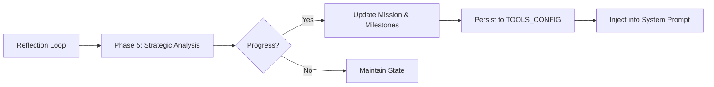

# System: Strategic Memory System (SMS)

**Status:** Production
**Owner:** Cognitive Architecture Team
**Last Updated:** 2026-04-11

## Overview
The Strategic Memory System (SMS) is the "long-term executive function" of SCAAI. While the Reflective Loop handles immediate self-awareness and history, the SMS is responsible for maintaining high-level project alignment across multiple days and sessions.

## Architecture

### High-Level Flow
The SMS operates as **Phase 5** of the cognitive cycle, running immediately after the Unified Field Engine has synchronized state.



### Components

#### 1. Strategic Engine (`strategicEngine.js`)
- **Technology**: Background LLM reasoning + JSON Schema parsing.
- **Logic**: 
  - Analyzes the current exchange against the `activeMission`.
  - Determines if milestones have transitioned from `pending` → `in-progress` → `completed`.
  - Automatically identifies new missions when a project-scale intent is detected.
- **Location**: `src/renderer/strategicEngine.js`

#### 2. Persistent State Layer
- **Storage**: `TOOLS_CONFIG`.
- **Sync**: Integrated into the `A.tools.save()` cycle in `renderer.js`.
- **Continuity**: Restored on boot in the `init()` sequence.

#### 3. Mission Roadmap UI
- **Location**: Project Home View (`phv`).
- **Visuals**: Displays the high-level mission and a checklist of milestones.
- **Binding**: Reacts in real-time to updates from the Strategic Engine.

## Data Schema

The system tracks state in the following structure:

```json
{
  "activeMission": "String: The high-level goal",
  "milestones": [
    {
      "title": "String",
      "status": "pending | in-progress | completed",
      "description": "Optional details"
    }
  ],
  "lastUpdate": "ISO Timestamp"
}
```

## Prompt Injection
The `_STRATEGIC_PLAN` is injected into the system prompt via `buildSystemPrompt()`:

```text
[ACTIVE STRATEGIC MISSION]
Mission: [Title]
Roadmap Status: [Milestones Recap]
Goal: Focus all sub-tasks toward these high-level objectives.
```

## Maintenance & Troubleshooting
- **State Mismatch**: If the visual roadmap is out of sync with your intent, simply tell SCAAI: "The project roadmap needs updating: [Correction]." The Phase 5 analysis will automatically catch and fix the mission data.
- **Persistence Reset**: Clearing `TOOLS_CONFIG` will reset the strategic memory.
